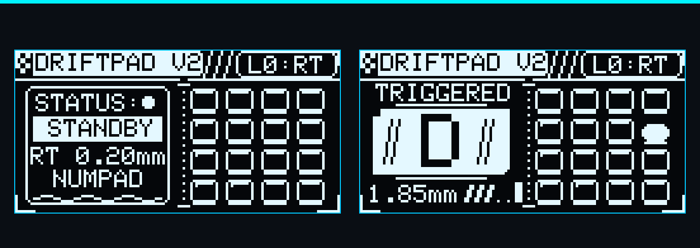

<h1 align="center">DriftPad</h1>

<p align="center">
  A 16-key Hall-effect macropad with analog key sensing, Rapid Trigger, an OLED cockpit display and a rotary encoder, built on the RP2040.
</p>

<p align="center">
  
  
  
  
</p>

<p align="center">
  
</p>

DriftPad is a custom Hall-effect macropad built around analog magnetic key sensing. Instead of a simple on/off switch, every key reports how far it has travelled, which lets the firmware support adjustable actuation and release points, Rapid Trigger, live travel feedback on the OLED, and per-layer keymaps you can change from the browser.

> **Status:** 2.1.0-beta.1, software-qualified and **not yet run on a physical pad**. Firmware, protocol v2 and the configurator pass the full automated suite (production C++ compiled on the host, headless-browser tests, tooling tests) and build for the RP2040. Hardware acceptance, PCB and enclosure files are still outstanding: see [docs/beta-checklist.md](docs/beta-checklist.md).

## Contents

- [Features](#features)
- [Repository layout](#repository-layout)
- [Quick start](#quick-start)
- [Hardware](#hardware)
- [How it works](#how-it-works)
- [Documentation](#documentation)
- [Roadmap](#roadmap)
- [License](#license)

## Features

- **Analog Hall-effect sensing** on all 16 keys through a CD74HC4067 analog multiplexer into the RP2040 ADC
- **Adjustable actuation point** from 0.25 to 3.80 mm
- **Rapid Trigger** with adjustable sensitivity from 0.10 to 2.00 mm, so a key re-actuates or releases as soon as it changes direction
- **Noise and drift handling:** velocity-adaptive filtering, automatic rest baseline tracking and magnet polarity auto-detection
- **Three keymap layers** out of the box: Numpad, Navigation and Gaming (WASD)
- **128×64 OLED cockpit UI** showing live key travel, the active layer and Rapid Trigger settings
- **Rotary encoder** for on-device menus: adjust actuation, adjust RT sensitivity, toggle RT and cycle layers
- **Browser configurator** over WebSerial with no install and no external dependencies: keymap editor, sensitivity, guided calibration, backup and restore
- **Settings stored in verified A/B flash slots**, so an interrupted save never loses the previous settings
- **Safe keyboard output:** off until the pad is calibrated, no stuck keys across remaps, layer changes, host sleep or unplugging

## Repository layout

| Path | What's in it |
|---|---|
| [`firmware/`](firmware) | PlatformIO project for the RP2040 (Arduino core by Earle Philhower) |
| [`firmware/src/`](firmware/src) | `hall.cpp` sensing and Rapid Trigger, `oled.cpp` display UI, `config.cpp` flash settings and keymaps, `encoder.cpp`, `mux.cpp`, `main.cpp` serial command handler |
| [`firmware/include/pins.h`](firmware/include/pins.h) | Pin assignments and key to multiplexer channel map |
| [`configurator/`](configurator) | WebSerial configurator (`index.html`; `keymap.html` redirects to it) and its tests |
| [`tests/`](tests) | Test harness: DSP model, firmware compiled on the host, configurator in headless Chrome, build checks, tooling |
| [`tools/`](tools) | Flash, release qualification, toolchain check, hardware acceptance tools, OLED renderers |
| [`docs/`](docs) | Documentation, OLED design concepts and rendered screenshots |
| [`hardware/`](hardware) | KiCad PCB project and mechanical STL / STEP files (placeholders for now) |

## Quick start

### 1. Build and flash the firmware

Install [PlatformIO](https://platformio.org/) (the VS Code extension or the CLI), then:

```bash
cd firmware
pio run                  # build
pio run -t upload        # flash over USB
```

The build output lands in `firmware/.pio/build/pico/`. You can also hold **BOOTSEL** while plugging in the Pico and copy `firmware.uf2` onto the drive that appears.

On Windows, `pio run -t upload` fails unless picotool's WinUSB driver is installed. `python tools/flash.py` avoids that: it checks the image, finds the pad by asking it (`INFO`), refuses to lose unsaved settings, reboots it into BOOTSEL, copies the UF2 and reads `INFO` again to confirm the new version. It never flashes without asking (`--yes` skips the question). See [tools/README.md](tools/README.md).

### 2. Configure it

Open [`configurator/index.html`](configurator/index.html) in Chrome, Edge or Opera (WebSerial is required) and click **Connect DriftPad**. Keyboard output stays off until the pad is calibrated: use the calibration wizard on the Device tab, then Save. From there you can remap keys, tune actuation and Rapid Trigger, switch layers, back up and restore. Add `?simulate=1` to try it without a pad. See [docs/configurator.md](docs/configurator.md).

Any serial terminal works too. See the [serial protocol reference](docs/serial-protocol.md).

### 3. Run the tests

```bash
python tests/run_all_tests.py             # everything that can run here, skips listed with reasons
python tests/run_all_tests.py --release   # the CI gate: no skips, fresh build, clean git tree
```

The suite needs Python 3, PlatformIO (build tests), a host C++ compiler (`pip install -r tests/requirements-dev.txt` provides one) and Chrome or Edge (configurator tests). Nothing in it touches hardware; [docs/testing.md](docs/testing.md) says what each suite does and does not prove.

## Hardware

| Part | Details |
|---|---|
| Microcontroller | Raspberry Pi Pico (RP2040) |
| Key sensors | 16 analog Hall-effect sensors in a 4×4 grid |
| Multiplexer | CD74HC4067, select lines on GP14 to GP17, output to GP26 / ADC0 |
| Display | SSD1306 128×64 OLED on I2C0 (SDA GP0, SCL GP1, address `0x3C`) |
| Encoder | Quadrature on GP20 / GP21, push switch on GP4 |

Full pinout and key to channel mapping: [docs/hardware.md](docs/hardware.md).

## How it works

Unlike a traditional mechanical keyboard switch that provides a simple digital on/off signal, DriftPad uses Hall-effect sensors to measure the position of each key magnetically. The firmware turns each 12-bit ADC reading into a travel distance in millimetres and then decides when the key is pressed:

1. **Filter.** A velocity-adaptive low-pass filter smooths heavily while the key is still (rejecting mains hum and sensor noise) and almost not at all while it is moving, so fast strokes are not delayed.
2. **Track the baseline.** While a key is at rest, its zero point slowly follows temperature and supply drift so it never triggers on its own.
3. **Actuate.** A key first fires when it passes the actuation point.
4. **Rapid Trigger.** After that, the firmware tracks the deepest and shallowest points of the stroke. Lifting by the RT sensitivity releases the key; pressing down by the same amount re-actuates it, without needing to return to the top.

The maths behind each step is in [docs/testing.md](docs/testing.md); the timing and core ownership in [docs/scheduling.md](docs/scheduling.md).

## Documentation

| Document | Contents |
|---|---|
| [docs/serial-protocol.md](docs/serial-protocol.md) | Serial protocol v2: framing, every command, error codes, limits |
| [docs/configurator.md](docs/configurator.md) | What the configurator does and guarantees |
| [docs/flash-layout.md](docs/flash-layout.md) | Flash map, A/B settings slots, interrupted saves, migration from v1 |
| [docs/scheduling.md](docs/scheduling.md) | Core ownership, the display snapshot, when flash is written |
| [docs/hardware.md](docs/hardware.md) | Pinout, multiplexer channel map, default keymaps, hardware readiness |
| [docs/testing.md](docs/testing.md) | Test suites and their scopes, requirements, filter and Rapid Trigger derivations |
| [docs/hardware-acceptance.md](docs/hardware-acceptance.md) | What a real pad must pass, item by item |
| [docs/beta-checklist.md](docs/beta-checklist.md) | Everything required before an external beta |
| [CHANGELOG.md](CHANGELOG.md) | Versions, fixes, compatibility and migration |
| [docs/oled_concepts/](docs/oled_concepts) | Alternative OLED layouts and key-press animations, with GIFs |
| [docs/images/](docs/images) | Pixel-accurate OLED screenshots rendered from the firmware drawing code |
| [tools/README.md](tools/README.md) | What each helper script does and how to run it |

## Roadmap

- [x] Hall-effect sensing, Rapid Trigger, OLED UI, rotary encoder
- [x] Keyboard output ownership, protocol v2, verified A/B settings, guided calibration
- [x] Consolidated WebSerial configurator
- [x] Reproducible build, CI, flash and release-qualification tools
- [ ] Hardware acceptance on a built pad ([docs/hardware-acceptance.md](docs/hardware-acceptance.md))
- [ ] Publish KiCad, BOM and enclosure files to `hardware/`
- [ ] Assembly guide and photographs
- [ ] External beta ([docs/beta-checklist.md](docs/beta-checklist.md))

## License

DriftPad is released under the [GNU General Public License v3.0](LICENSE).
